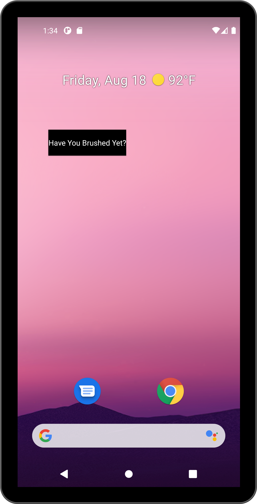

# Brush - a simple reminder widget 🪥

After having a tooth filled, I realized I needed to remember to brush my teeth more often, hence this really simple widget! When you click the button this will disappear until the evening (or more accurately 10 hours later) at which point hte button shows up again.
 
 

  

 

## I'm underwhelmed 😂 
That's alright my wife said, "Wow you're a child" when I showed her this. 

 

## How To Build This: 🛠
We all know that android studio can be finnicky importing projects. This project was build with: `Android Studio Flamingo | 2022.2.1 Patch 2` so I'd recommend matching that version of Android Studio if you're having issues importing this project. 

 

## App Store Download📱

 

## Find this project useful? 🔎

* Support it by clicking the 🌟 button on the upper right of this page. 🔥

